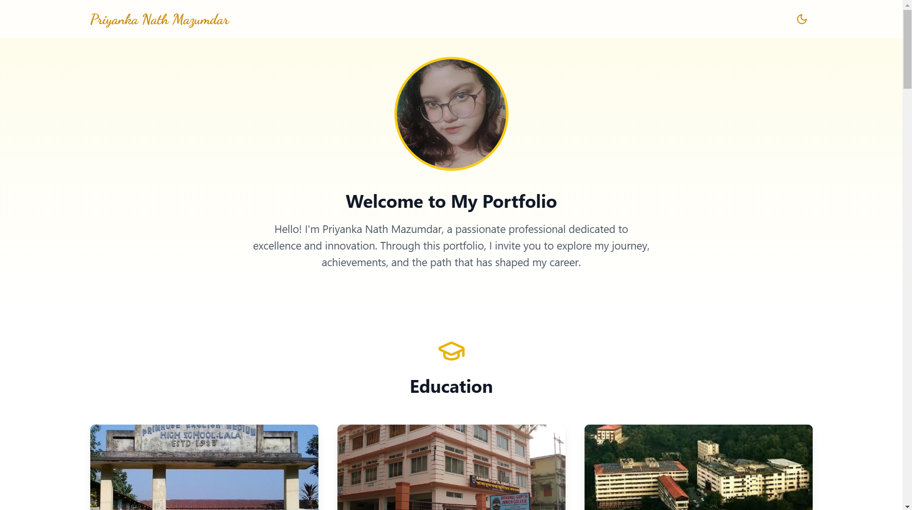

# 👋 Hi, I'm Priyanka

<div align="center">
  
  
  [](https://priyanka-v-01.vercel.app)
</div>

## 🎯 About This Project

A modern, responsive portfolio website built with vanilla HTML, CSS, and JavaScript. This project showcases my professional journey, skills, and projects in a clean and intuitive interface.

## ✨ Key Features

- 🎨 Clean and modern design
- 📱 Fully responsive layout
- ⚡ Fast loading performance
- 🎭 Smooth animations and transitions
- 🌐 Cross-browser compatibility
- 🌙 Dark Mode support
- 🔍 SEO optimized

## 🛠️ Tech Stack

- **Frontend**: HTML5, CSS3, Vanilla JavaScript
- **Layout**: Flexbox & Grid
- **Animations**: CSS Transitions & Effects
- **Hosting**: Vercel
- **Version Control**: Git & GitHub

## 📁 Project Structure

```
Priyanka-Portfolio-V-01/
├── index.html
├── assets/
│   ├── css/
│   ├── js/
│   ├── images/
│   └── fonts/
├── README.md
└── LICENSE
```

## 📋 Portfolio Sections

| Section | Components |
|---------|------------|
| 👤 Hero | Profile image, Name & title, Social links, CTA buttons |
| 📝 About | Bio, Experience, Interests |
| 💡 Skills | Technical skills, Soft skills, Progress bars |
| 🎓 Education | Degree details, Institution, Timeline |
| 🚀 Projects | Project cards, Screenshots, Live demos |
| 📬 Contact | Contact form, Social links, Email |

## 🚀 Getting Started

1. Clone the repository:
```bash
git clone https://github.com/Priyanka5055/Priyanka-Portfolio-V-01.git
```

2. Navigate to the project directory:
```bash
cd Priyanka-Portfolio-V-01
```

3. Open `index.html` in your browser

## 🌐 Live Demo

Visit the live portfolio at [priyanka-v-01.vercel.app](https://priyanka-v-01.vercel.app)

## 🤝 Contributing

Contributions, issues, and feature requests are welcome! Feel free to check the [issues page](https://github.com/Priyanka5055/Priyanka-Portfolio-V-01/issues).

## 📝 License

This project is licensed under the MIT License - see the [LICENSE](LICENSE) file for details.

## 📫 Connect With Me

- GitHub: [Mausam5055](https://github.com/Mausam5055/)
- LinkedIn: Coming Soon
- Email: Coming Soon

---
<div align="center">
  Made with ❤️ by Mausam
</div>

